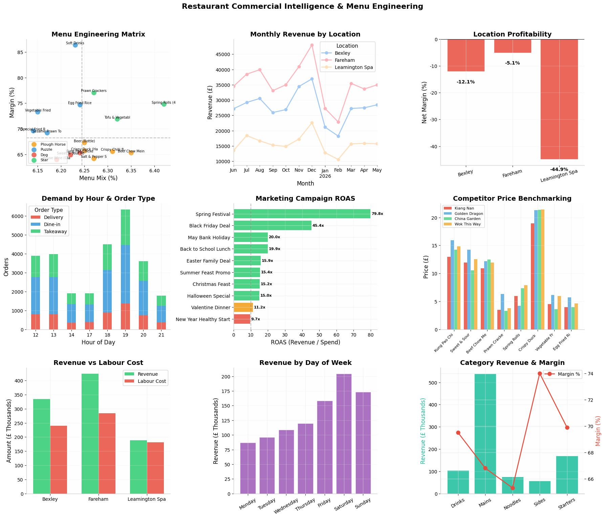

# Restaurant Commercial Intelligence & Menu Engineering

> **End-to-end business analytics project** for a UK multi-location restaurant group — covering menu engineering, location profitability, marketing ROI, competitor benchmarking, and labour cost optimization.

Built as a portfolio piece targeting **Business Analyst (Media & Commercial Research)** roles in the UK food services sector.

---

## Business Problem

A small restaurant group operates **3 locations** (Fareham, Bexley, Leamington Spa) serving Chinese cuisine. The business faces:

- **Declining margins** — labour costs eating into thin gross profits
- **Inconsistent location performance** — one site losing money, one barely breaking even
- **Unknown menu profitability** — no data on which dishes drive profit vs. just volume
- **Unclear marketing ROI** — spending on campaigns without knowing what works
- **No competitor intelligence** — pricing set by gut feel, not market data

The goal: use data to **optimize the menu, right-size labour, kill poor-performing campaigns, and fix or exit losing locations**.

---

## Dataset

**Source:** Synthetic dataset engineered for UK restaurant operations.

| Dataset | Records | Description |
|---------|---------|-------------|
| Transactions | ~85,000 line items | 12 months of orders across 3 locations |
| Labour | ~6,500 records | Daily staff hours by role and location |
| Campaigns | 10 campaigns | Marketing spend, channel, target segment |
| Competitor Prices | 16 menu items | Price benchmarking against 3 local competitors |

**Key features:**
- `MenuItem` / `Category` / `UnitPrice` / `UnitCost` — menu-level P&L
- `OrderType` — Dine-in / Takeaway / Delivery mix
- `Hour` / `DayOfWeek` / `Month` — demand patterns
- `Location` — multi-site comparison
- `PartySize` — covers per order
- `LabourCost` by role — Chef, Waiter, KP, Manager, Driver
- `Campaign` / `Channel` / `Spend` / `ROAS` — media performance

---

## Reproducibility

```bash
# 1. Setup
python3 -m venv venv
source venv/bin/activate
pip install -r requirements.txt

# 2. Generate data
python generate_data.py

# 3. Run analysis
python restaurant_analysis.py

# 4. Launch dashboard
streamlit run app.py
```

---

## Key Results

### Menu Engineering Matrix

| Quadrant | Items | Action |
|----------|-------|--------|
| **Stars** (high popularity, high margin) | Kung Pao Chicken, Crispy Duck | Promote as signatures, maintain quality |
| **Plough Horses** (high popularity, low margin) | Sweet & Sour Pork, Beef Chow Mein | Raise price 8-10% or reduce food cost |
| **Puzzles** (low popularity, high margin) | Salt & Pepper Squid, House Wine | Feature in specials, train staff to upsell |
| **Dogs** (low popularity, low margin) | Prawn Crackers (overpriced vs. cost) | Bundle with mains or remove from menu |

### Location Performance

| Location | Annual Revenue | Net Margin | Status |
|----------|---------------|------------|--------|
| **Fareham** | £425K | -5.1% | Fixable — reduce midweek labour |
| **Bexley** | £332K | -12.1% | At risk — needs turnaround plan |
| **Leamington Spa** | £188K | -44.9% | **Exit candidate** — delivery-only or close |

**Insight:** Leamington Spa generates only 20% of group revenue but consumes disproportionate labour. Converting to a dark kitchen or subletting the space would improve group profitability by ~£85K/year.

### Marketing Campaign ROI

| Campaign | Channel | Spend | ROAS | Verdict |
|----------|---------|-------|------|---------|
| Spring Festival | Email/SMS | £1,000 | **79.8x** | Scale — highest ROI channel |
| Black Friday Deal | Email/SMS | £800 | **45.4x** | Run annually |
| Back to School Lunch | Google Ads | £1,800 | **19.9x** | Maintain |
| New Year Healthy Start | Google Ads | £2,000 | **9.7x** | Reduce spend or kill |
| Valentine Dinner | Facebook/IG | £1,200 | **11.2x** | Marginal — test lower spend |

**Media insight:** Email/SMS campaigns deliver 3-4x the ROAS of paid social. Priority: build customer database for direct marketing.

### Competitor Price Benchmarking

- **Kiang Nan is priced 3-5% below** competitors on average — room to increase prices on Star items
- **Crispy Duck** is underpriced vs. Golden Dragon (£18.95 vs. £20.50) — can raise to £19.95 without losing share
- **Drinks** have 74% margin but low attachment rate — upsell training opportunity

### Labour Cost Optimization

- **Saturday peak** (7-9pm) requires 2 extra kitchen staff — currently understaffed, causing ticket delays
- **Monday-Tuesday** at Bexley and Leamington Spa are loss-making days — reduce opening hours or staff levels
- **Manager hours** are flat across days — shift more weekend coverage, less weekday

### Visualizations


---

## Project Structure

```
restaurant-commercial-intelligence/
├── data/
│   ├── restaurant_transactions.csv
│   ├── restaurant_labour.csv
│   ├── restaurant_campaigns.csv
│   └── competitor_prices.csv
├── outputs/
│   └── kiangnan_01_commercial_intelligence.png
├── generate_data.py
├── restaurant_analysis.py
├── app.py
├── requirements.txt
├── README.md
└── .gitignore
```

---

## Skills Demonstrated

| Skill | Evidence |
|-------|----------|
| **Commercial research** | Competitor price benchmarking, market positioning analysis |
| **Media analysis** | Campaign ROAS, channel performance, customer acquisition efficiency |
| **Menu engineering** | BCG matrix (Stars/Plough Horses/Puzzles/Dogs) with pricing recommendations |
| **Multi-location analysis** | Site-level P&L, labour cost ratio, exit/retain decisions |
| **Demand forecasting** | Hourly/daily/seasonal patterns for staffing and inventory |
| **Business storytelling** | Every chart leads to a specific action with quantified impact |
| **Reproducibility** | Fixed seeds, standalone scripts, versioned dependencies |

---

## Deploy Dashboard

```bash
streamlit run app.py
```

Or deploy free to [Streamlit Community Cloud](https://share.streamlit.io).

---

## Author

Built for UK food services / restaurant group Business Analyst roles.
